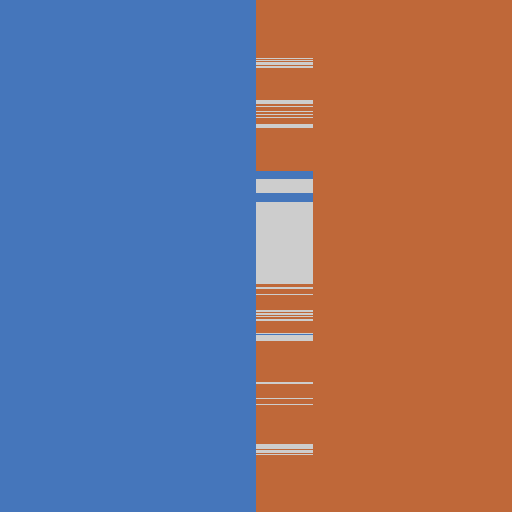
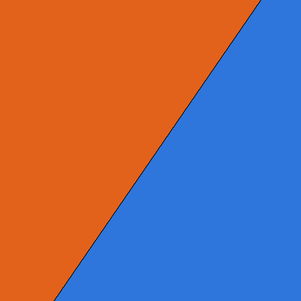

# Predicate Plot Gallery

This document is a review guide for the images generated by
`examples/predicate_plots.rs`. The images live under `doc/predicate-plots`, so
run the demo before reviewing this page in a Markdown viewer.

## Generate

Default f64 plots:

```sh
cargo run --example predicate_plots -- --out doc/predicate-plots --size 512
```

Full backend plot set:

```sh
RUSTFLAGS='-Ctarget-cpu=haswell' cargo run --example predicate_plots --features geogram,robust,hyperreal,realistic-blas,interval -- --backend all --out doc/predicate-plots --size 512
```

Regenerate only the floating-point zoom companions:

```sh
RUSTFLAGS='-Ctarget-cpu=haswell' cargo run --example predicate_plots --features geogram,robust,hyperreal,realistic-blas,interval -- --backend all --out doc/predicate-plots --size 512 --zoom-only
```

`inari` 2.0.0 requires Haswell-class SIMD on x86-64, so the full command uses
`RUSTFLAGS='-Ctarget-cpu=haswell'`.

Individual backend batches can be rendered with `--backend f64`,
`--backend hyperreal`, `--backend realistic_blas`, or `--backend interval`.

## Legend

- Blue: positive, left, or above.
- Orange: negative, right, or below.
- White: zero or on-boundary.
- Black: unknown.
- Light tint: exact/refined/robust fallback provenance.
- Gray tint: approximate provenance.

The generated `manifest.txt` in the output directory lists every image and its
description.

## Floating-Point Zoom Companions

Each regular plot has a matching `_fp_zoom.png` image centered on a predicate
boundary with a `1e-15` world-space span. These zooms use the approximate,
no-fallback policy so the raw floating-point decision surface is visible.
For scalar backend batches, `--zoom-only` aliases the corresponding f64 zoom
render because this section is specifically a floating-point precision probe.

### F64 Zooms

| Predicate | Strict Zoom | Approximate Zoom | Strict, No Fallback Zoom |
| --- | --- | --- | --- |
| `orient2d` |  |  |  |
| line side |  |  |  |
| `incircle2d` |  |  |  |
| explicit plane on `z=0` |  |  |  |
| oriented plane on `z=0` |  |  |  |
| `insphere3d` cross-section |  |  |  |

### hyperreal Zooms

| Predicate | Strict Zoom | Approximate Zoom | Strict, No Fallback Zoom |
| --- | --- | --- | --- |
| `orient2d` |  |  |  |
| line side |  |  |  |
| `incircle2d` |  |  |  |
| explicit plane on `z=0` |  |  |  |
| oriented plane on `z=0` |  |  |  |
| `insphere3d` cross-section |  |  |  |

### realistic_blas Zooms

| Predicate | Strict Zoom | Approximate Zoom | Strict, No Fallback Zoom |
| --- | --- | --- | --- |
| `orient2d` |  |  |  |
| line side |  |  |  |
| `incircle2d` |  |  |  |
| explicit plane on `z=0` |  |  |  |
| oriented plane on `z=0` |  |  |  |
| `insphere3d` cross-section |  |  |  |

### Interval Zooms

| Predicate | Strict Cell Zoom |
| --- | --- |
| `orient2d` |  |
| `incircle2d` |  |
| explicit plane on `z=0` |  |

## F64 Predicates

These plots use primitive `f64` coordinates and demonstrate the baseline
pipeline, including filters, optional fallback, and approximate policy.

| Predicate | Strict | Approximate | Strict, No Fallback |
| --- | --- | --- | --- |
| `orient2d` |  |  |  |
| line side |  |  |  |
| `incircle2d` |  |  |  |
| explicit plane on `z=0` |  |  |  |
| oriented plane on `z=0` |  |  |  |
| `insphere3d` cross-section |  |  |  |

## hyperreal Predicates

These plots use `hyperreal::Real` coordinates created from the sampled pixel
values. They exercise structural facts and bounded refinement before fallback.

| Predicate | Strict | Approximate | Strict, No Fallback |
| --- | --- | --- | --- |
| `orient2d` |  |  |  |
| line side |  |  |  |
| `incircle2d` |  |  |  |
| explicit plane on `z=0` |  |  |  |
| oriented plane on `z=0` |  |  |  |
| `insphere3d` cross-section |  |  |  |

## realistic_blas Predicates

These plots use `realistic_blas::Scalar<DefaultBackend>`. They exercise the
facts forwarded by `realistic_blas` through the same predicate pipeline.

| Predicate | Strict | Approximate | Strict, No Fallback |
| --- | --- | --- | --- |
| `orient2d` |  |  |  |
| line side |  |  |  |
| `incircle2d` |  |  |  |
| explicit plane on `z=0` |  |  |  |
| oriented plane on `z=0` |  |  |  |
| `insphere3d` cross-section |  |  |  |

## Interval Cell Predicates

These plots use `inari::Interval` and treat each pixel as a cell interval rather
than a point sample. Black bands show cells whose interval enclosure still spans
both sides of the predicate boundary.

| Predicate | Strict Cell Plot |
| --- | --- |
| `orient2d` |  |
| `incircle2d` |  |
| explicit plane on `z=0` |  |
